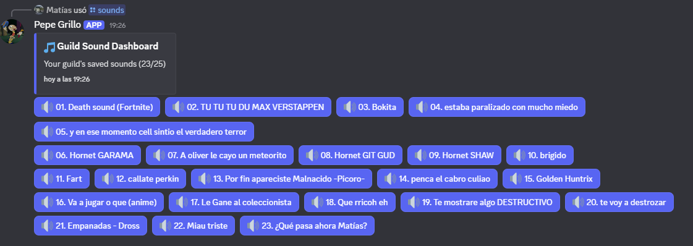

# Pepe Grillo - A MyInstants Discord Bot


Just a Discord bot that scrapes [myinstants.com](https://myinstants.com) and plays sounds in your server's voice channels.



## Features

- 🎵 Play sounds from myinstants.com in voice channels
- 💾 Save up to **100 sounds per server** (increased from 25!)
- 📋 **Smart select menu dashboard** with pagination (replaces button UI)
- 🔄 **Auto-refreshing dashboards** - updates when sounds are added/deleted
- 🗑️ Delete saved sounds with a command or automatically the oldest when limit is reached
- 🚫 Ignores duplicates
- ⏱️ Auto-disconnects after 15 minutes of inactivity
- 🐳 Docker only (PostgreSQL + Redis included)

## Setup (Docker Only)

1. Clone this repo
   ```bash
   git clone https://github.com/matiasvelizb/pepe-grillo.git
   cd pepe-grillo
   ```
2. Copy the env file and edit it
   ```bash
   cp .env.example .env
   # Edit .env with your Discord token and client ID
   ```
3. Build and run everything
   ```bash
   docker-compose up -d --build
   ```
4. Check logs if you want
   ```bash
   docker-compose logs -f bot
   ```

5. That's it. If you want to stop it:
   ```bash
   docker-compose down
   ```

> [!IMPORTANT]
> Discord now requires the bot to support the new AEAD voice encryption modes. The bundled Docker image runs on Node.js 22.12 and pre-installs `libsodium-wrappers` so you're ready to go after rebuilding the containers.

## Commands

- `/play <url>` — Play and save a sound from myinstants.com
- `/sounds` — Show your saved sounds in an interactive select menu with pagination
- `/delete` — Delete a sound using an interactive select menu (no need to remember numbers!)
- `/stop` — Stop playback and leave voice channel

## What's New in v2.0.0

### 🎉 Unified UI System
- **100 sounds per server** (up from 25)
- **Configurable UI** - Choose between BUTTONS or SELECT menus via `.env`
- **Pagination** - navigate through 4 pages of sounds (25 per page)
- **Auto-refresh** - dashboards update automatically when sounds are added/deleted
- **SOLID architecture** - unified `UIBuilder` with DRY principles
- **Both /sounds and /delete** - use the same UI system and pagination

### 📖 Documentation
- See [`docs/unified-ui-system.md`](docs/unified-ui-system.md) for complete system overview
- See [`docs/migration-guide.md`](docs/migration-guide.md) for upgrade instructions from v1.x
- See [`docs/DEPLOYMENT_GUIDE.md`](docs/DEPLOYMENT_GUIDE.md) for deployment instructions

### ⚙️ Configuration

Choose your preferred UI type in `.env`:

```bash
# BUTTONS: Classic 5x5 grid interface (default)
UI_TYPE=BUTTONS

# SELECT: Modern dropdown menus (more compact)
UI_TYPE=SELECT
```

## How It Works

1. Scrapes myinstants.com for the audio file
2. Downloads the audio to a temp folder
3. Joins your voice channel and plays it with FFmpeg
4. Cleans up and leaves after playing
5. Saves the sound to the database if not a duplicate

## Troubleshooting

- Bot doesn't join voice: Make sure you're in a voice channel and the bot has permissions
- Audio doesn't play: Check FFmpeg is installed in the container, and the URL is valid
- "Failed to scrape sound": myinstants.com changed, or bad URL
- Bot is offline: Check your token in `.env` and that the container is running
- "No compatible encryption modes": Rebuild the containers (`docker-compose up -d --build`) so they pick up the Node.js 22.12 base image and updated dependencies, or ensure your custom runtime includes Node.js ≥ 22.12 with either native AES-GCM support or one of the supported sodium libraries.
