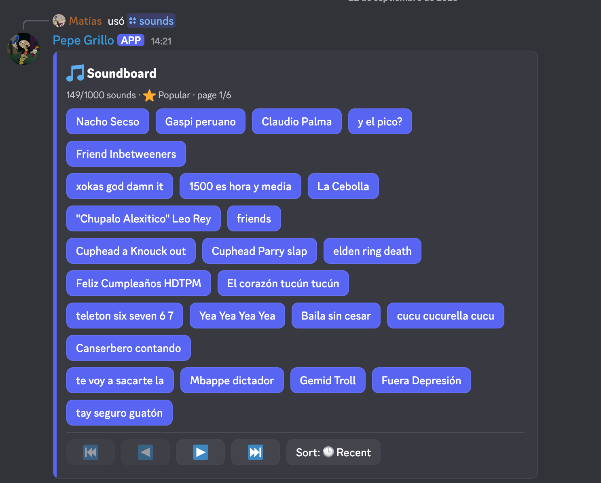
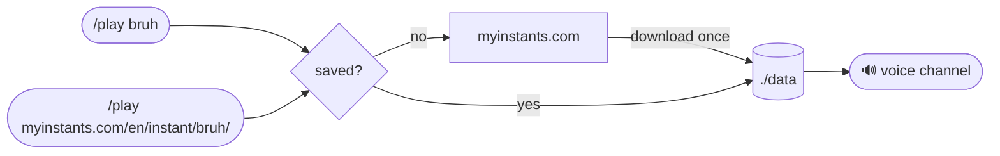

# MyInstants Discord Soundboard

Discord bot that plays sounds from [myinstants.com](https://www.myinstants.com) in voice channels.



## How it works


```mermaid
flowchart LR
    N(["/play bruh"]) --> S{"saved?"}
    L(["/play myinstants.com/en/instant/bruh/"]) --> S
    S -->|no| M["myinstants.com"] -->|download once| D[("./data")]
    S -->|yes| D
    D --> V(["🔊 voice channel"])
```

Sounds are saved per server, so the next play comes straight from disk — and so does every button on the soundboard.

## Commands

| Command | Description |
|---|---|
| `/play <sound>` | Play a sound by name or link. New sounds are saved to the server. |
| `/sounds` | Post the soundboard |
| `/delete` | Delete sounds |
| `/stop` | Stop and leave the voice channel |

`/play` autocompletes as you type: saved sounds first, then MyInstants search results.

## Setup

```bash
cp .env.example .env   # add DISCORD_TOKEN and CLIENT_ID
mkdir -p data logs
docker compose up -d --build
```

Sounds are stored in `./data` (SQLite + audio files), logs in `./logs`.

Without Docker, you need Node 24+ and `ffmpeg`:

```bash
npm install && npm start
```

## Configuration

Set in `.env`, see [`.env.example`](.env.example) for the full list.

| Variable | Default | Description |
|---|---|---|
| `DISCORD_TOKEN` | | Bot token |
| `CLIENT_ID` | | Application ID |
| `GUILD_ID` | | Register commands to one server instantly instead of globally |
| `MAX_SOUNDS_PER_GUILD` | `1000` | Oldest sounds are removed past this limit. `0` = unlimited |
| `LOG_LEVEL` | `info` | `debug` for verbose output |

## Notes

- MyInstants sits behind Cloudflare: requests use a Chrome TLS fingerprint ([impit](https://github.com/apify/impit)), with [FlareSolverr](https://github.com/FlareSolverr/FlareSolverr) as fallback for JavaScript challenges
- The bot leaves the voice channel after 15 minutes of inactivity
- Activity is logged to `logs/soundboard-YYYY-MM-DD.log`, kept 7 days
